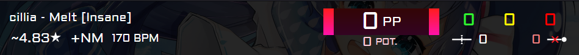

# SlimPP

PP counter/theme for [gosumemory](https://github.com/l3lackShark/gosumemory). Use in your osu! streams to show your viewers your current performance statistics!

Features:

- Beatmap background image
- Artist, song name and difficulty (scrolls right to left if too long)
- Approximate star rating
- Mods used
- BPM
- Live PP value
- Potential maximum PP value
- 100/50/0 counts
- Unstable rate
- Slider break count

To customize, just go into style.css and change the root variables (found in the `:root` block) to different colors if you want. Please note that the star icon's color will not change if you change text color as it is an image.

Best used for standard mode, not recommended for other modes (they can function, however the star rating calculation doesn't work. plus not all mania hits will show up).

Looking for mania statistics? Check [MinigameJudge](https://github.com/vysiondev/MinigameJudge) out!
